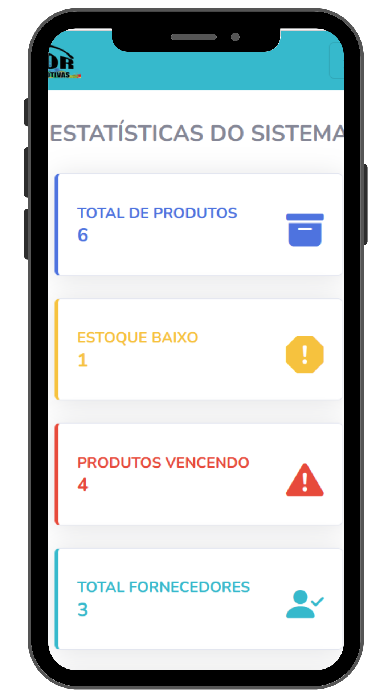
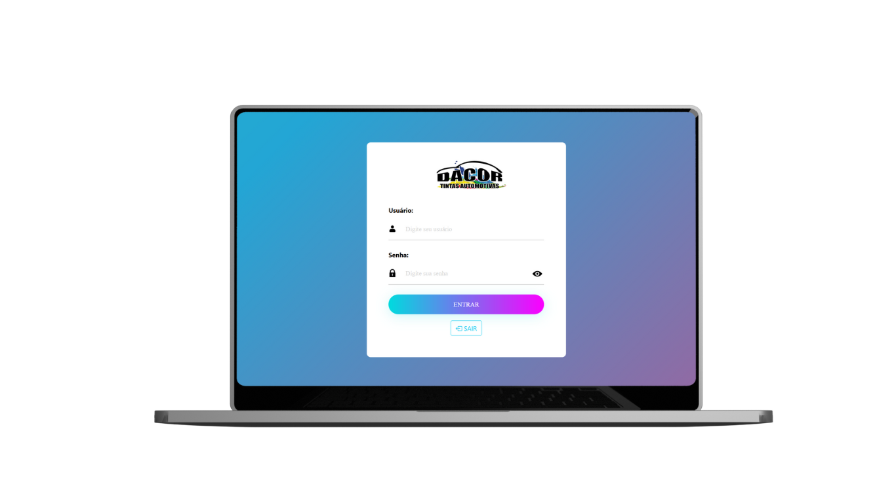
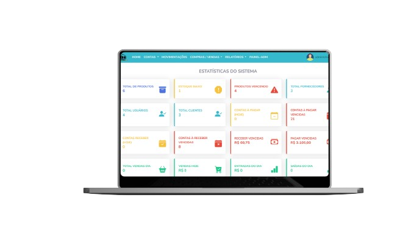

<h1 align="center">
    
</h1>

<h4 align="center"> 
	🚧  Sistema Desenvolvido para o TCC 🚧
</h4>

 <a href="#-sobre-o-projeto">Sobre</a> •
 <a href="#-principais-funcionalidades">Funcionalidades</a> •
 <a href="#-layout">Layout</a> • 
 <a href="#-como-executar-o-projeto">Usuários Teste</a> • 
 <a href="#-tecnologias">Tecnologias</a> • 
 <a href="#-contribuidores">Contribuidores</a> • 

## 💻 Sobre o projeto

🌎 A Dacorweb, foi o Trabalho de Conclusão de Curso (TCC) apresentado em 2023 no IFC, tem como propósito a criação de um software abrangente para gerenciamento e controle de vendas, estoque, usuários e geração de relatórios. Vale ressaltar que o sistema é caracterizado por um layout simples e funcional, incorporando um painel de controle (dashboard) e gráficos para proporcionar uma experiência completa e intuitiva, além dos níveis separados por sessões para cada usuário.

Confira o Software, clique no link [Dacorweb](https://blog.rocketseat.com.br/primeira-next-level-week/).

---

## ⚙️ Principais Funcionalidades

 - [x] PAINEL ADMINISTRADOR: 

    - >CADASTRAR:
        - Funcionários;
        - Fornecedores;
        - Formas de Pagamento;
        - Clientes,
        #####
    - > EM PRODUTOS:
        - Cadastrar Produtos;
        - Cadastrar Categorias;
        - Listar ás Compras;
        - Listar estoque Baixo;
        - Ver alertas de Vencimento.
    #####
    - > VENDAS:
        - Listar Venda.

        #####
    - > EM RELATÓRIOS:
        - Relatórios de Produtos;
        - Relatórios de Compras;
        - Relatórios de Vendas;
        - Relatórios de Produtos Vendidos;
        - Relatórios de Contas Receber;
        - Relatórios de Contas Receber Vencidas;
        - Relatórios de Produtos Vencendo.
         

 - [x] PAINEL FINANCEIRO: 
   
     
    - > EM CONTAS (VER/CADASTRAR):
        - Contas á Pagar;
        - Contas á Receber;
        - Pagar Constas Vencidas;
        - Pagar Hoje;
        - Receber Vencidas.
 
    - > MOVIMENTAÇÕES:
        - Ver as Movimentações;

     - > COMPRAS / VENDAS:
        - Listar Vendas;     
        - Listar Compras.
 
    - > EM RELATÓRIOS:
        - Relatórios de Movimentações;
        - Relatórios de Contas á Pagar;
        - Relatórios de Contas á Receber;
        - Relatórios de Contas á Receber Vencidas;

 - [x] PAINEL OPERADOR: 
 
     
    - > DENTRO DO PDV:
        - Passar Produtos;
        - Consultar Produtos;
        - Listar Produtos;
        - Fechar Venda;
        - Gerar Cupom;      
        - ...      

    
---

## 🎨 Layout

O layout do software busca ser claro, bonito e prático, além responsivo:
 -  <b>Obs:</b> Aqui é apenas uma ilustração, por isso não está 100% responsivo,

### Mobile

  

  

  

### Web

  

   

   

---

## 🚀 Usuários

 - [x] Este sistema possuí 3 níveis de hierarquia:
>    ##### 1º ADMINISTRADOR 
>    Usuário: Administardor
    Senha: 123

>   ##### 2º FINANCEIRO 
>    Usuário: Financeiro
    Senha: 123

>    ##### 3º OPERADOR  
>    Usuário: Operador
    Senha: 123

💡Tanto o <b>Usuário</b> quanto a <b>Senha</b> Tem que serem exatamente iguais.

## 🛠 Tecnologias

As seguintes ferramentas foram usadas na construção do projeto:

-   **[PHP](https://www.php.net/manual/pt_BR/index.php)**
-   **[JAVASCRIPT](https://developer.mozilla.org/pt-BR/docs/Web/JavaScript)**
-   **[HTML](https://developer.mozilla.org/pt-BR/docs/Web/HTML)**
-   **[CSS](https://developer.mozilla.org/pt-BR/docs/Web/CSS)**
-   **[BOOTSTRAP](https://getbootstrap.com/)**
-   **[MYSQL](https://www.mysql.com/)**

---

## 👨‍💻 Contribuidores

Foram essenciais para a realização deste  SoftWare.
<table>
  <tr>
    <td align="center"><a href="https://josehenrique.online"> <b>José Henrique</b></a> <a href="https://rocketseat.com.br/" title="Rocketseat">Programador</a></td>
    <td align="center"><a href="#"> <b>Minha Dupla</b></a> <a href="https://rocketseat.com.br/" title="Rocketseat">Design</a></td>    
  </tr>

</table>

---
